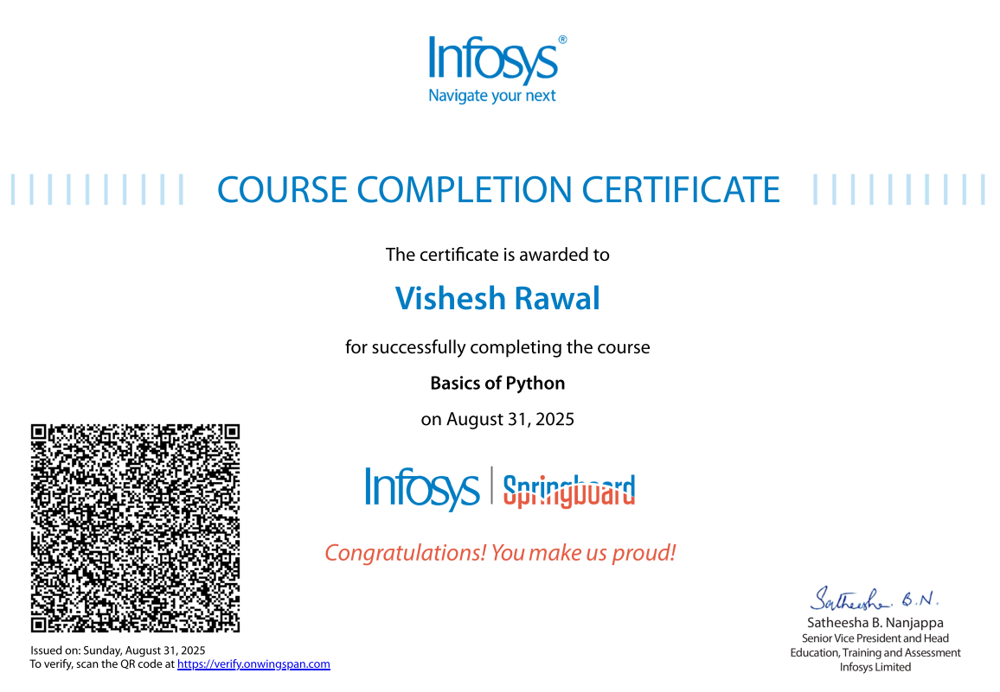
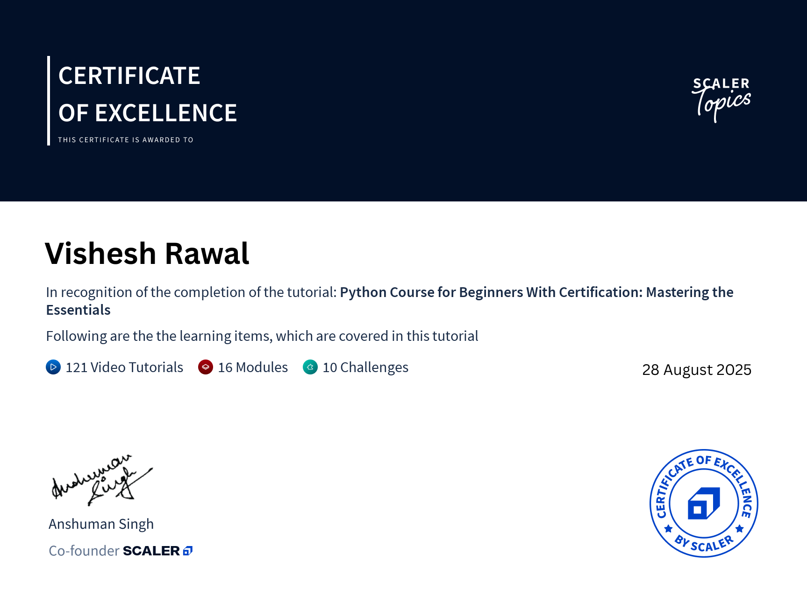

# Vishesh Rawal Labs 🧠💻

This is where I break limits and build future tech — one line of code at a time.

## 🧪 Current Modules
- Python Basics ✅
- Git/GitHub Mastery ✅
- AI/ML 🔜
- VLSI, IoT, EV Tech 🔜

### Certificates
- Infosys Springboard — [PDF](certificates/2025-Infosys-Python-Basics.pdf) • 
- Scaler — [PDF](certificates/2025-Scaler-Python-Fundamentals.pdf) • 

Stay tuned — this repo evolves with me.
