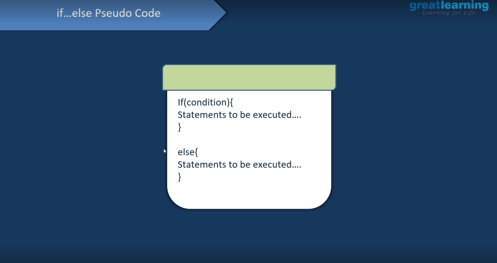

# Decision Making Statements
-To make a **decision** on th basis of a **condition**.

```python
# This is just an example
if vishesh is learning:
    print("Good Job!")
else:
    print("Get back at it!") 
```



