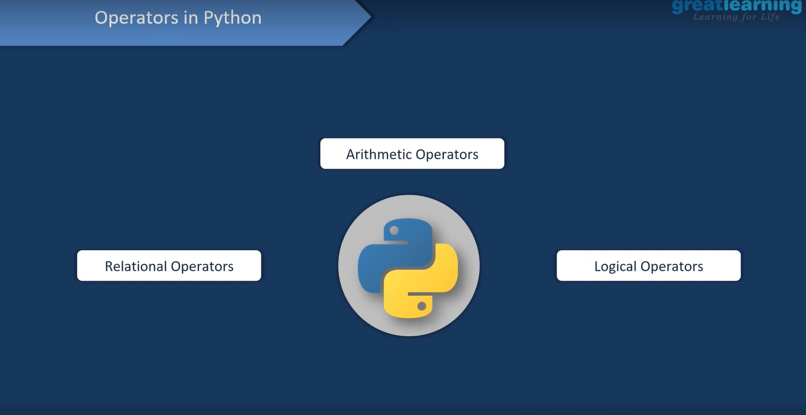

#Operators in Python
##There are three types of operators in python


##Arithmatic Operators
```python
a=10
b=20
#+,-,*,/ Arithematic Operators
a+b
a-b
a*b
b/a

#Relational operators >,<,==,!=
a>b
a<b
a==b
a!=b

#Logical operators & |
a=True
b=False
a&b
b&b
a&a
a|b
b|a
a|a
b|b
```
 
