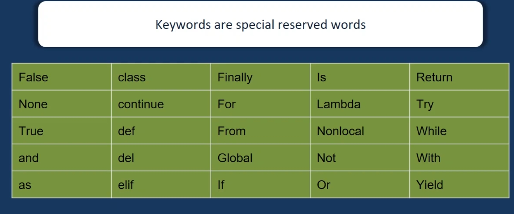

# Python Tokens
- Smallest meaningful Component in a Program
## Types
- Keywords
- Identifiers
- Literals
- Operators

# Python Keywords 

 

 # Identifiers
 - Identifiers are names used for variables, functions or objects
## Rules
- No Special character except _(Underscore)
- Identifiers are case sensitive
- First letter cannot be a digit
 
 # Literals
 - Literals are constants in Python.
  ```python
  a1 = "Vishesh"
  a1 = 007
  a1 = True
  ```